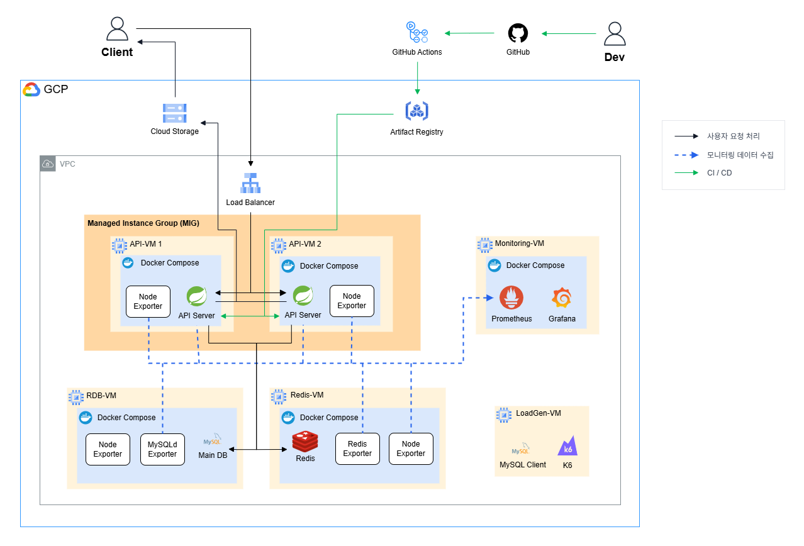
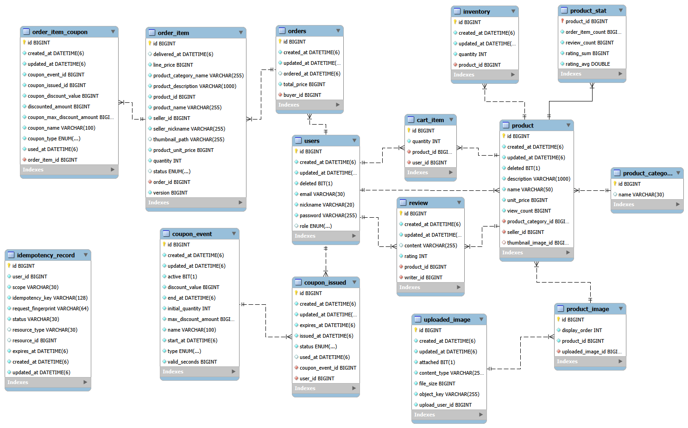

# Ecommerce-API

이커머스 서비스의 주문, 재고, 쿠폰 등 정합성과 신뢰성이 중요한 기능을 구현하고,  
실제 구매 플로우를 가정한 부하 테스트를 통해 트래픽 증가 시 발생하는 성능·정합성 문제를 관측, 개선

## 주요 성과

**1. 주문 생성 DB 호출 수 감축을 통한 병목 완화**  
API 응답 시간 p95 4.88s -> 2.02s로 약 58.6% 개선

**2. 주문 생성, 취소 멱등성 보장**  
해당 API에서의 중복 요청 문제 (부수효과 중복 발생, 사용자 혼란 등) 제거

**3. API VM Scale-Out을 통한 병목 해결**  
API VM 병목 제거, 주문 시나리오 안정 처리량 55 iter/s -> 95 iter/s로 개선

## 핵심 기능

- 상품 검색
- 상품 재고 관리: 주문 시 재고 차감, 취소 시 복구, 음수재고 방지
- 상품 할인쿠폰 발급 및 사용
- 주문 생성, 취소, 상태 변경

## 기술 스택

- Java 21, Spring Boot 4, JPA, Querydsl
- MySQL, Redis
- Prometheus, Grafana, GCP, Docker, GitHub Actions, K6

## 아키텍처 다이어그램

## ER Diagram

  

# 성과 상세
 

## Case 1. 주문 생성 DB 호출 수 감축을 통한 병목 완화

### 문제 상황

사용자 주문 플로우를 모방한 부하테스트에서 60 iter/s (약 156 RPS) 기준,  
API VM CPU 및 HikariCP 병목 식별

#### 테스트 구성

- 1 iteration: 주문 생성 -> 주문 상세조회 `-> (약 30%) 주문항목 취소 -> 주문 상세조회`

구간 구성:
- Warm Up: 25 iter/s (약 65 RPS), 3분
- 휴식 구간: 30초
- 측정 구간: 60 iter/s (약 156 RPS), 3분 30초

#### 측정 결과

| 지표                                  | 측정값 |
| ------------------------------------- | -----: |
| 주문 생성 API p95                     |  4.88s |
| 주문 생성 API p99                     |  6.81s |
| HikariCP pending connection max       |    191 |
| HikariCP acquire time rolling avg max |   1.2s |
| API VM CPU 사용률 max                        |  99.1% |

- 주문 생성 API 응답 시간이 가장 느림
- 주문 생성 1회당 DB 호출 평균 19회 발생

---

### 해결 과정

#### 원인 후보

- 많은 DB 호출로 인한 App-DB 간 RTT 누적
- 많은 DB 호출로 인한 App 단 JPA/JDBC 처리 CPU 부하
- 작은 HikariCP pool size

HikariCP pool size 부족 가능성은 낮다고 판단했으나, 검증 비용이 작으므로 빠르게 검증하고 배제

#### 검증 결과 (pool size 10 -> 30)

| 지표              |  이전 | 조정 후 |   변화 |
| ----------------- | ----: | ------: | -----: |
| 주문 생성 API p95 | 4.88s |   6.92s | +41.8% |
| 주문 생성 API p99 | 6.81s |  11.05s | +62.3% |

=> **악화됨.**  
단순 pool size 부족 가능성 배제

 

남은 두 가설은 원인 추정은 다르나, 해결책은 **DB 호출 수 축소**로 동일  
정확한 원인 규명보다 빠른 진행의 가치가 크다고 판단, 공통 해결책으로 진행
  

#### 해결방안 선택 기준

- DB 호출 수 축소 우선
- 주문 정합성 유지
- JPA 이점 과도한 포기 방지
- 수정 범위 최소화

#### 최종 적용 사항

- 재고 차감 JDBC batching
- 재고 선조회 제거
- 주문통계 업데이트 JDBC batching

#### 미적용 사항

- `OrderItem` insert batching
  - `Cascade.PERSIST` 포기 + `OrderItemCoupon` 스냅샷 흐름 연쇄 변경 필요
- Outbox 기반 비동기화
  - 현재는 일시적 불일치를 허용 가능한 부분이 적음. 비용 대비 이점이 적음
  - 주문 파생 동작이 늘어나면 재검토
  

---

### 결과

| 지표                       | 변경 전 | 변경 후 |  개선 |
| -------------------------- | ------: | ------: | ----: |
| 주문 생성 API p95          |   4.88s |   2.02s | **58.6%** |
| 주문 생성 API p99          |   6.81s |   4.28s | **37.2%** |
| DB 호출 수                 |    19회 |    14회 | **26.3%** |
| HikariCP pending 평균      |    61.8 |      23 | **62.8%** |
| HikariCP acquire time 평균 |   295ms |    83ms | **71.5%** |

#### 한계
지표들이 평균값 기준으로는 개선되었으나, 최대값 기준으로는 병목이 남음

| 지표                                  | 측정값 |
| ------------------------------------- | -----: |
| 주문 생성 API p99                     |  4.28s |
| HikariCP pending connection max       |    190 |
| HikariCP acquire time rolling avg max |   1.2s |
| API VM CPU 사용률 max                        |  98.3% |

#### 배운 점

- JVM Warm-Up의 필요성
- 성능 측정 목적에 따른 테스트 설계(부하율 수준, 구간 구성 등)
- 지표를 기반으로 한 병목 원인 파악 과정

   

## Case 2. 주문 생성, 취소 멱등성 보장

### 문제 상황

주문 생성과 주문항목 취소 API는 재고, 쿠폰, 장바구니 등 여러 부수효과를 동반  
기존에는 멱등성 보장 처리가 없어 다음 문제 발생 가능

- 네트워크 재시도, 버튼 중복 클릭 등으로 같은 주문 중복 생성
- 중복 요청 시 1회만 성공하고 실패 응답 반환 -> 사용자 혼란
- 주문항목 상태 변경 동시 요청 시 lost update, 부수효과 중복 실행, 상태 전이 충돌

#### 목표

- 같은 논리 요청이 여러 번 들어와도 실제 로직은 1회만 수행
- 이후 요청은 성공 응답 replay 또는 재시도 가능한 409 Conflict로 정리
- 논리적 중복 실행 방지뿐 아니라, 사용자가 실패로 오해해 중복 요청하는 문제 해결

### 해결 과정

#### 멱등성 보장 방식

| API           | 판단 기준                                                | 적용 방식                                                   |
| ------------- | -------------------------------------------------------- | ----------------------------------------------------------- |
| 주문 생성     | 기존 리소스가 없어 상태만으로 수행 여부 판단이 어려움    | `Idempotency-Key` 기반으로 논리 요청 식별    |
| 주문항목 취소 | 기존 주문항목의 상태를 기준으로 요청 수행 여부 판단 가능 | 이미 취소된 항목은 성공 no-op 처리, 부수효과 중복 실행 방지 |

#### `IdempotencyRecord` 방식의 트랜잭션 구성
- 선택: 2개 트랜잭션 (`PROCESSING` record 생성 / 본 요청 수행 + `SUCCEEDED` 상태 변경)
  - 단일 트랜잭션보다 복잡하지만, 동시 요청 충돌 식별 용이
  - 3개 트랜잭션 방식은, '본 요청 성공 후 `SUCCEEDED` 처리 실패' 케이스 고려 필요

#### `IdempotencyRecord` unique 조건 범위
- 선택: 사용자, 기능 범위 (`user_id + scope + idempotency_key`)
  - 다른 사용자나 다른 API 요청으로 인한 실패, 잘못된 replay 응답 방지
  - 인덱스 Key 길이 증가는 감수함

#### 주문항목 동시성 문제 해결 방식

- 선택: `@Version` 기반 낙관적 락
  - 충돌 가능성이 매우 낮음
  - 간헐적 409 Conflict 및 재시도 유도는 수용 가능

#### 멱등성 로직 구현 방식

- 선택: Wrapper service 추가
  - 구현 비용이 적음. 적용 대상이 적은 경우에 적합
  - AOP 기반 방식은 구현 비용이 큼. 범용화 필요성이 실제로 커졌을 때 적용하는 것이 낫다고 판단
  - 기존 service에 로직을 직접 추가하는 방식은, 도메인 로직과 web계층(멱등 처리) 로직이 혼합

### 결과(적용 사항)

- 주문 생성 요청에 `Idempotency-Key` 헤더를 요구하고, 미포함 시 400 Bad Request 응답
- 같은 논리 주문 생성 요청은 1회만 수행하고 이후 요청은 저장된 성공 응답 replay
- 다른 요청 간 `Idempotency-Key`가 중복되면 409 Conflict 응답
- 주문항목 취소 중복 요청은 부수효과를 반복하지 않고 성공 no-op 처리
- 동시 상태 변경 충돌은 409 Conflict 응답으로 재시도 유도

#### 배운 점

- 서비스 개발 시 "사용자를 고려하는 것"이 "논리적으로 맞게 구현하는 것"보다 중요할 수 있음
  - 기존에는 이미 `CANCELED` 상태인 주문항목 취소 요청에 실패 응답 반환 -> 사용자 혼란 유발
- 트랜잭션 격리 수준, 커밋 시점, 정합성 관리 포인트를 고려한 트랜잭션 설계

   

## Case 3. API VM Scale-Out을 통한 병목 해결

### 문제 정의

Case 1 완료 후에도, 같은 주문 시나리오 60 iter/s 기준 API VM 및 HikariCP 병목 잔존

| 지표                                     | 측정값 |
| ---------------------------------------- | -----: |
| 주문 생성 API p95                        |  2.02s |
| 주문 생성 API p99                        |  4.28s |
| API VM CPU 사용률 max                           |  98.3% |
| HikariCP acquire time rolling avg max |   1.2s |
| HikariCP pending connection max          |    190 |

#### 목표

- 기존 테스트 기준 60 iter/s 안정 처리
  - 개별 API p99 < 3s
  - 전체 요청 실패율 < 1%
  - 기존 병목 지점 포함, 지표상 식별되는 병목 제거

### 해결 과정

#### 해결 방안 선택

**동일한 API VM 2개로 Scale-Out**하는 방안 선택

| 선택지                        | 판단                                                                                |
| ----------------------------- | ----------------------------------------------------------------------------------- |
| Scale-Out (동일한 API VM 여러 개) | App 계층 처리량 분산에 직접적인 효과가 있고, 유연한 확장 구조를 만들 수 있음 |
| Scale-Out (서비스 분리)    | 현재 목표 대비 고려할 점이 많음(서비스 분리 기준, 분산 트랜잭션, 운영 복잡도 등)     |
| Scale-Up (단일 API VM 유지)        | 단일 VM 장애 시 서비스가 중지되고, VM 교체나 스케일링을 무중단으로 수행하려면 추가 조치 필요  |
 

#### 추가 결정사항 1. 인증 세션 저장 방식

- 선택: Redis에 세션 저장
  - Spring Session과 통합이 잘 되어 있고, 기존에 이미 Redis를 사용 중
  - Sticky Session 방식은 부하 분산이 균등하지 않을 수 있고, API VM 장애 시 일부 세션 유실 가능
  - JWT기반 구조 전환은 고려할 사항이 많고, 진행한다면 별도 작업으로 분리 필요

#### 추가 결정사항 2. 스케줄 작업 중복 실행 문제

기존 스케줄 작업:
1) 진행 예정인 `CouponEvent` 캐시 작업
2) 상품 조회수 Redis -> RDB flush 작업

- 두 작업 모두 중복 실행으로 인한 문제는 없음
- 상품 조회수 flush 작업의 성능 개선이 필요
  - 기존에는 상품 ID 1건씩 처리하는 구조
 
개선 방안:
- 적정 chunk 단위 배치 처리
  - 여러 VM이 작업을 병렬 수행 가능
  - 분산 락, 별도 worker 분리보다 가용성이 높고 고려할 부분이 적음

### 결과

#### 기능 검증

- [x] 트래픽이 실제로 API VM들에 고르게 분산
- [x] 로그인 시 세션 정보가 Redis에 저장
- [x] 요청이 어떤 VM에 들어가도 세션이 유지
- [x] 캐시 대상 `CouponEvent`가 Redis에 1개씩만 적재
- [x] 상품 조회수가 실제 발생한 수치만큼만 RDB에 적재

#### 성능 검증

- [x] 60 iter/s: API 응답 성공 기준 만족, 지표상 병목 없음
- [x] 95 iter/s: 4회 측정값 평균 기준, 안정 처리

#### 95 iter/s 측정 결과 (4회 평균 기준)

| 지표                                     | 측정값 |
| ---------------------------------------- | ----------------------: |
| 주문 생성 API p95                        |                   119ms |
| 주문 생성 API p99                        |                   190ms |
| API VM 평균 CPU 사용률 max               |                  57.18% |
| HikariCP pending connection max          |                       4 |
| HikariCP acquire time rolling avg max |                  2.97ms |

#### 한계

- 상품 조회수 flush 작업 중 신규 조회되는 상품이 많으면 일부 조회수 업데이트 지연 가능
- Redis나 API VM 장애 시 조회수 일부 유실 가능
- Redis 장애 시 세션 정보 유실 가능
- 무중단 배포는 아님
  - 이는 이번 작업의 목표가 아니며, 현재 상황에서 중요성 낮음

#### 배운 점

- 멀티 인스턴스 환경에서의 스케줄 작업 관리 방식
- '지금 처리해야 할 일'과 '별도 작업으로 처리할 일'을 구분하는 것
- 작업의 결과를 명확히 판단하는 데에 있어서, 완료 기준의 중요성

  

## 기타 문서

- [API 명세](docs/api-spec.md)
