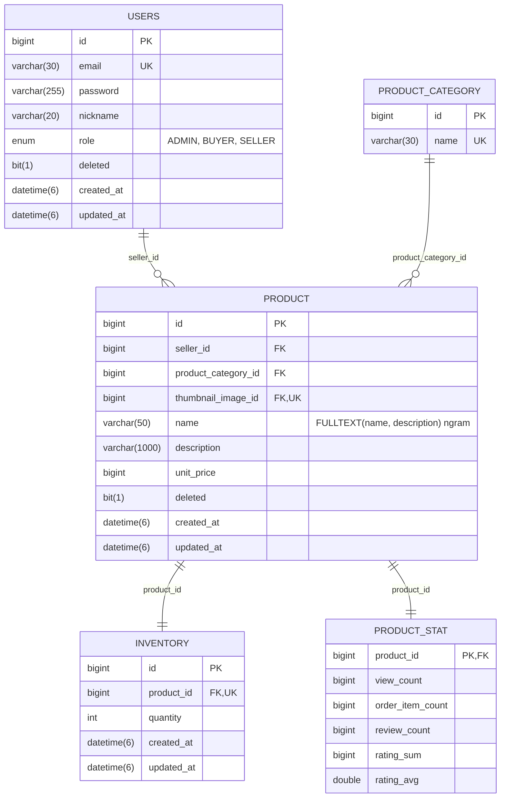
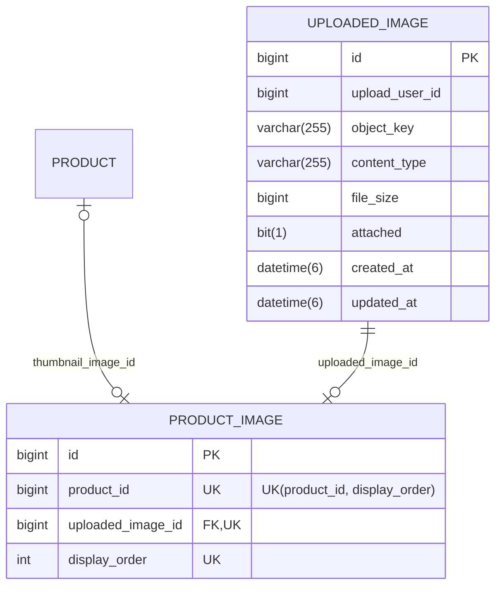
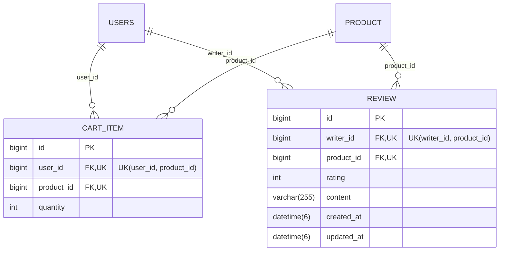
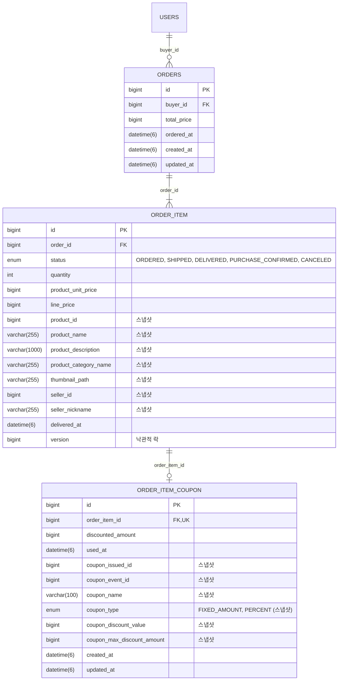
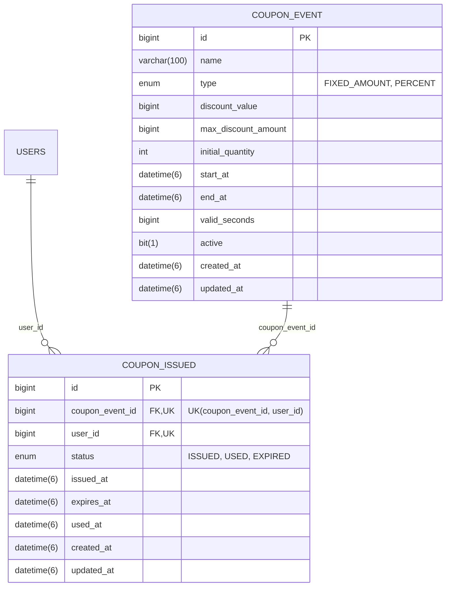
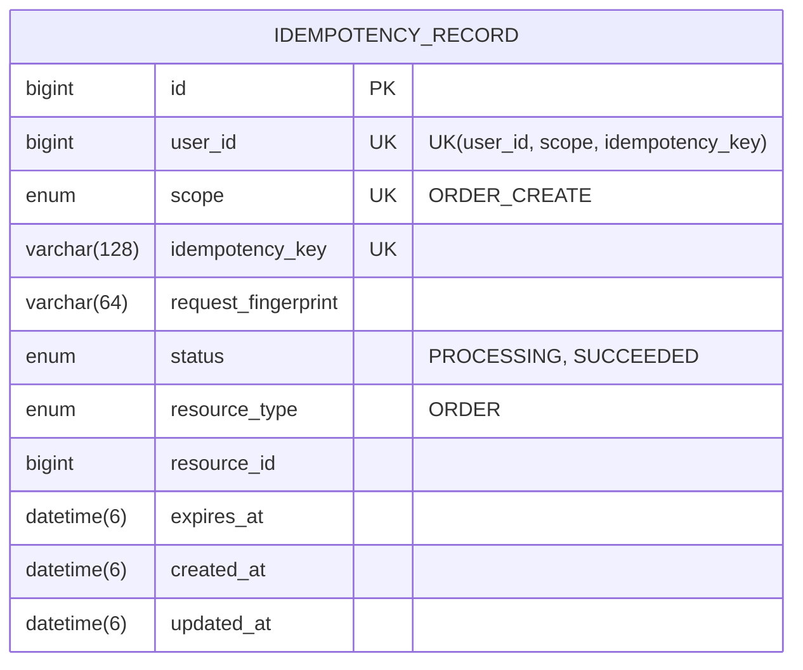

# Ecommerce-API

이커머스 서비스의 주문, 재고, 쿠폰 등 정합성과 신뢰성이 중요한 기능을 구현하고,  
실제 구매 플로우를 가정한 부하 테스트를 통해 트래픽 증가 시 발생하는 성능·정합성 문제를 관측, 개선

## 핵심 도메인과 기능

- 주문: 장바구니 항목으로 주문 생성(멱등 키로 중복 주문 방지), 주문항목별 배송·구매확정·취소
- 재고: 주문 시 조건부 차감으로 음수 재고와 초과 판매 방지, 취소 시 복구
- 쿠폰: Redis 선착순 발급(이벤트당 1인 1장), 주문 시 사용, 취소 시 복구
- 상품: 등록·수정·삭제, 전문 검색(FULLTEXT, ngram)과 정렬, 조회수 집계
- 그 밖에: 회원·세션 인증, 장바구니, 리뷰·평점, 상품 이미지 업로드(GCS 서명 URL)

API 명세: [Swagger UI](https://ehighg.github.io/Ecommerce-API/) · [openapi.yaml](docs/api/openapi.yaml)

## 주요 성과

**1. [주문 생성 DB 호출 수 감축을 통한 병목 완화](docs/cases/01-order-query-batching.md)**  
API 응답 시간 p95 4.88s -> 2.02s로 약 58.6% 개선

**2. [주문 생성, 취소 멱등성 보장](docs/cases/02-order-idempotency.md)**  
해당 API에서의 중복 요청 문제 (부수효과 중복 발생, 사용자 혼란 등) 제거

**3. [API VM Scale-Out을 통한 병목 해결](docs/cases/03-horizontal-scale-out.md)**  
API VM 병목 제거, 주문 시나리오 안정 처리량 55 iter/s -> 95 iter/s로 개선

## 아키텍처 다이어그램

## ERD

도메인별로 나눠 그렸다. 다른 그림에서 컬럼을 보인 테이블은 이름만 표시한다. 관계선은 DB의 외래 키다.

- 표의 칸은 타입, 컬럼, 키(PK·FK·UK), 비고 순이다.
- 비고의 `UK(a, b)`는 여러 컬럼을 묶은 유니크 키다. 묶인 컬럼에 모두 `UK`를 붙였다.
- 비고의 "스냅샷"은 주문 시점 값을 복사해 둔 컬럼이다.
- 외래 키가 없는 참조: `order_item`의 상품·판매자 ID와 `order_item_coupon`의 쿠폰 이벤트·발급 쿠폰 ID(스냅샷), `product_image.product_id`, `uploaded_image.upload_user_id`, `idempotency_record.user_id`.

### 회원·상품

```mermaid
erDiagram
    USERS ||--o{ PRODUCT : "seller_id"
    PRODUCT_CATEGORY ||--o{ PRODUCT : "product_category_id"
    PRODUCT ||--|| INVENTORY : "product_id"
    PRODUCT ||--|| PRODUCT_STAT : "product_id"

    USERS {
        bigint id PK
        varchar(30) email UK
        varchar(255) password
        varchar(20) nickname
        enum role "ADMIN, BUYER, SELLER"
        bit(1) deleted
        datetime(6) created_at
        datetime(6) updated_at
    }
    PRODUCT_CATEGORY {
        bigint id PK
        varchar(30) name UK
    }
    PRODUCT {
        bigint id PK
        bigint seller_id FK
        bigint product_category_id FK
        bigint thumbnail_image_id FK, UK
        varchar(50) name "FULLTEXT(name, description) ngram"
        varchar(1000) description
        bigint unit_price
        bit(1) deleted
        datetime(6) created_at
        datetime(6) updated_at
    }
    INVENTORY {
        bigint id PK
        bigint product_id FK, UK
        int quantity
        datetime(6) created_at
        datetime(6) updated_at
    }
    PRODUCT_STAT {
        bigint product_id PK, FK
        bigint view_count
        bigint order_item_count
        bigint review_count
        bigint rating_sum
        double rating_avg
    }
```

### 상품 이미지

```mermaid
erDiagram
    PRODUCT |o--o| PRODUCT_IMAGE : "thumbnail_image_id"
    UPLOADED_IMAGE ||--o| PRODUCT_IMAGE : "uploaded_image_id"

    PRODUCT_IMAGE {
        bigint id PK
        bigint product_id UK "UK(product_id, display_order)"
        bigint uploaded_image_id FK, UK
        int display_order UK
    }
    UPLOADED_IMAGE {
        bigint id PK
        bigint upload_user_id
        varchar(255) object_key
        varchar(255) content_type
        bigint file_size
        bit(1) attached
        datetime(6) created_at
        datetime(6) updated_at
    }
```

### 장바구니·리뷰

```mermaid
erDiagram
    USERS ||--o{ CART_ITEM : "user_id"
    USERS ||--o{ REVIEW : "writer_id"
    PRODUCT ||--o{ CART_ITEM : "product_id"
    PRODUCT ||--o{ REVIEW : "product_id"

    CART_ITEM {
        bigint id PK
        bigint user_id FK, UK "UK(user_id, product_id)"
        bigint product_id FK, UK
        int quantity
    }
    REVIEW {
        bigint id PK
        bigint writer_id FK, UK "UK(writer_id, product_id)"
        bigint product_id FK, UK
        int rating
        varchar(255) content
        datetime(6) created_at
        datetime(6) updated_at
    }
```

### 주문

```mermaid
erDiagram
    USERS ||--o{ ORDERS : "buyer_id"
    ORDERS ||--|{ ORDER_ITEM : "order_id"
    ORDER_ITEM ||--o| ORDER_ITEM_COUPON : "order_item_id"

    ORDERS {
        bigint id PK
        bigint buyer_id FK
        bigint total_price
        datetime(6) ordered_at
        datetime(6) created_at
        datetime(6) updated_at
    }
    ORDER_ITEM {
        bigint id PK
        bigint order_id FK
        enum status "ORDERED, SHIPPED, DELIVERED, PURCHASE_CONFIRMED, CANCELED"
        int quantity
        bigint product_unit_price
        bigint line_price
        bigint product_id "스냅샷"
        varchar(255) product_name "스냅샷"
        varchar(1000) product_description "스냅샷"
        varchar(255) product_category_name "스냅샷"
        varchar(255) thumbnail_path "스냅샷"
        bigint seller_id "스냅샷"
        varchar(255) seller_nickname "스냅샷"
        datetime(6) delivered_at
        bigint version "낙관적 락"
    }
    ORDER_ITEM_COUPON {
        bigint id PK
        bigint order_item_id FK, UK
        bigint discounted_amount
        datetime(6) used_at
        bigint coupon_issued_id "스냅샷"
        bigint coupon_event_id "스냅샷"
        varchar(100) coupon_name "스냅샷"
        enum coupon_type "FIXED_AMOUNT, PERCENT (스냅샷)"
        bigint coupon_discount_value "스냅샷"
        bigint coupon_max_discount_amount "스냅샷"
        datetime(6) created_at
        datetime(6) updated_at
    }
```

### 쿠폰

```mermaid
erDiagram
    USERS ||--o{ COUPON_ISSUED : "user_id"
    COUPON_EVENT ||--o{ COUPON_ISSUED : "coupon_event_id"

    COUPON_EVENT {
        bigint id PK
        varchar(100) name
        enum type "FIXED_AMOUNT, PERCENT"
        bigint discount_value
        bigint max_discount_amount
        int initial_quantity
        datetime(6) start_at
        datetime(6) end_at
        bigint valid_seconds
        bit(1) active
        datetime(6) created_at
        datetime(6) updated_at
    }
    COUPON_ISSUED {
        bigint id PK
        bigint coupon_event_id FK, UK "UK(coupon_event_id, user_id)"
        bigint user_id FK, UK
        enum status "ISSUED, USED, EXPIRED"
        datetime(6) issued_at
        datetime(6) expires_at
        datetime(6) used_at
        datetime(6) created_at
        datetime(6) updated_at
    }
```

### 멱등 키 기록

```mermaid
erDiagram
    IDEMPOTENCY_RECORD {
        bigint id PK
        bigint user_id UK "UK(user_id, scope, idempotency_key)"
        enum scope UK "ORDER_CREATE"
        varchar(128) idempotency_key UK
        varchar(64) request_fingerprint
        enum status "PROCESSING, SUCCEEDED"
        enum resource_type "ORDER"
        bigint resource_id
        datetime(6) expires_at
        datetime(6) created_at
        datetime(6) updated_at
    }
```
